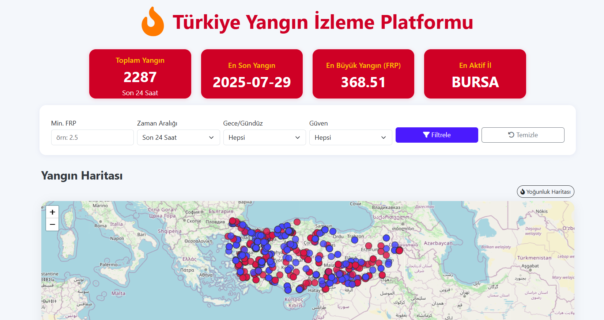

# 🇹🇷 Türkiye Yangın İzleme Platformu

[](LICENSE)
[](https://www.python.org/)
[](https://www.djangoproject.com/)

🔥 **Gerçek zamanlı yangın verilerini NASA FIRMS ve OpenStreetMap ile birleştiren, modern ve interaktif bir web uygulaması.**

---

## 📸 Ekran Görüntüsü

<p align="center">
  
</p>

---

## 🚀 Özellikler

- 📍 **Canlı Harita**: Türkiye genelinde tespit edilen yangın noktalarını harita üzerinde gösterir.
- 📊 **Grafik Analizleri**: FRP dağılımı, saat, güven skoru ve bölgeye göre yangın istatistikleri.
- 🔎 **Filtreleme**: Tarih, gece/gündüz, güven skoru ve yangın gücüne (FRP) göre filtreleme.
- 🗺️ **OpenStreetMap Entegrasyonu**: Harita tabanlı interaktif görünüm ve yoğunluk haritası.
- 🏷️ **Güncel NASA FIRMS Verisi**: Otomatik veri çekme ve güncel yangın takibi.
- 🌙 **Koyu ve modern tema**, mobil ve masaüstü uyumlu.

---

## 📦 Kurulum

```bash
# 1. Repoyu klonla
git clone https://github.com/kullaniciadi/yangin-izleme-platformu.git
cd yangin-izleme-platformu

# 2. Sanal ortam oluştur ve aktif et
python -m venv venv
source venv/bin/activate  # Windows için: venv\Scripts\activate

# 3. Gerekli paketleri kur
pip install -r requirements.txt

# 4. Django veritabanını oluştur
python manage.py migrate

# 5. Sunucuyu başlat
python manage.py runserver
